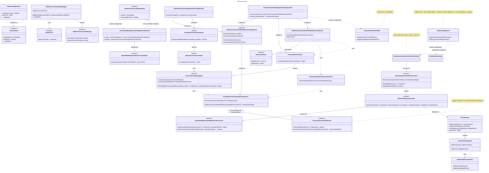

```mermaid
---
title: "@Transactional"
---
classDiagram
    direction TB
    class Transactional {
        <<interface>>
        +propagation() Propagation
        +isolation() Isolation
        +...andMore()
    }
    class BusinessRepository {
        +save(Entity entity) boolean
        +get(ID id) Entity
        +...andMore()
    }
    
    BusinessRepository ..> Transactional : depends on

    class PlatformTransactionManager {
        <<interface>>
        +commit(TransactionStatus status)
        +rollback(TransactionStatus status)
    }
    class DataSourceTransactionManager {
        -DataSource datasource
        #doBegin(Object transaction, TransactionDefinition definition)
        #...andMore()
    }
    class DataSource {
        <<interface>>
        +getConnection() Connection
    }
    DataSourceTransactionManager ..> DataSource : uses
    DataSourceTransactionManager --|> PlatformTransactionManager : extends
    
    class EnableTransactionManagement {
        <<interface>>
        +mode() AdviceMode
        +proxyTargetClass() boolean
    }
    class TransactionManagementConfigurationSelector {
        -proxy() AutoProxyRegistrar + ProxyTransactionManagementConfiguration
        -aspectj() AspectJ/Jta/TransactionManagementConfiguration
    }
    class AdviceModeImportSelector~Annotation~ {
        <<abstract>>
        #selectImports(AdviceMode adviceMode)* Array~String~
    }
    
    TransactionManagementConfigurationSelector --|> AdviceModeImportSelector : implements
    EnableTransactionManagement ..> TransactionManagementConfigurationSelector : imports configuration
    TransactionManagementConfigurationSelector --> EnableTransactionManagement : uses annotation metadata
    
    class AspectJTransactionManagementConfiguration {
        +transactionAspect() AnnotationTransactionAspect
    }
    class AnnotationTransactionAspect {
        <<aspect>>
        #transactionalMethodExecution(Object txObject) Pointcut
    }
    class AbstractTransactionAspect {
        <<aspect>>
        +invokeWithinTransaction() advice
    }
    AspectJTransactionManagementConfiguration --|> AbstractTransactionManagementConfiguration : is based on
    AspectJTransactionManagementConfiguration --> AnnotationTransactionAspect : configures
    AnnotationTransactionAspect --|> AbstractTransactionAspect : extends
    AbstractTransactionAspect ..> TransactionAspectSupport : uses

    class ProxyTransactionManagementConfiguration {
        +transactionAdvisor() BeanFactoryTransactionAttributeSourceAdvisor
        +transactionInterceptor() TransactionInterceptor
    }
    class AbstractTransactionManagementConfiguration {
        <<abstract>>
        #AnnotationAttributes enableTx
        #TransactionManager txManager
        +transactionAttributeSource()
        +transactionalEventListenerFactory()
    }
    class AnnotationTransactionAttributeSource {
        Set~TransactionAnnotationParser~ annotationParsers
        #determineTransactionAttribute(AnnotatedElement element) TransactionAttribute
    }
    class TransactionAnnotationParser {
        <<interface>>
        +isCandidateClass(Class~?~ targetClass) boolean
        +parseTransactionAnnotation(AnnotatedElement element) TransactionAttribute
    }
    note for TransactionAnnotationParser "supports Spring, JTA and EJB3 based annotations"
    AbstractTransactionManagementConfiguration --> AnnotationTransactionAttributeSource : configures
    AnnotationTransactionAttributeSource o-- TransactionAnnotationParser : scans classpath for implementations
    
    class BeanFactoryTransactionAttributeSourceAdvisor {
        -TransactionAttributeSourcePointcut pointcut
        -Advice advice
    }
    class PointcutAdvisor {
        <<interface>>
        +getPointcut() Pointcut
        +getAdvice() Advice
    }
    class TransactionAttributeSourcePointcut {
        -TransactionAttributeSource transactionAttributeSource
    }
    BeanFactoryTransactionAttributeSourceAdvisor --|> PointcutAdvisor : implements
    BeanFactoryTransactionAttributeSourceAdvisor ..> TransactionAttributeSourcePointcut : uses
    TransactionAttributeSourcePointcut ..> AnnotationTransactionAttributeSource : uses
    
    class TransactionInterceptor {
        +invoke(MethodInvocation invocation) Object
    }
    class TransactionAspectSupport {
        <<abstract>>
        -TransactionManager transactionManager
        -TransactionAttributeSource transactionAttributeSource
        #invokeWithinTransaction(Method method, Class~?~ targetClass, InvocationCallback invocation) Object
    }
    TransactionInterceptor --|> TransactionAspectSupport : extends
    TransactionAspectSupport ..> AnnotationTransactionAttributeSource : uses
    BeanFactoryTransactionAttributeSourceAdvisor ..> TransactionInterceptor : uses
    
    class TransactionRuntimeHints {
        +registerIsolationFromReflection()
        +registerPropagationFromReflection()
    }
    note for TransactionRuntimeHints "used for AOT compilation"
   
    ProxyTransactionManagementConfiguration --|> AbstractTransactionManagementConfiguration : is based on
    ProxyTransactionManagementConfiguration --> TransactionInterceptor : configures
    ProxyTransactionManagementConfiguration --> BeanFactoryTransactionAttributeSourceAdvisor : configures
    ProxyTransactionManagementConfiguration ..> TransactionRuntimeHints : imports configuration

    class AutoProxyRegistrar {
        +registerOrEscalateApcIfNecessary()
        +enforceClassProxyIfNecessary()
    }
    note for AutoProxyRegistrar "initializes APC only if AdviceMode == PROXY,\nmode depends on `proxyTargetClass` property"
    class InfrastructureAdvisorAutoProxyCreator
    note for InfrastructureAdvisorAutoProxyCreator "only infrastructure beans used as advisors"
    class AbstractAdvisorAutoProxyCreator {
        <<abstract>>
        -BeanFactoryAdvisorRetrievalHelper advisorRetrievalHelper
        #findEligibleAdvisors() List~Advisor~
        #isEligibleAdvisorBean() boolean
    }

    AutoProxyRegistrar ..|> EnableSpellcasting : inherits configuration
    AutoProxyRegistrar ..> InfrastructureAdvisorAutoProxyCreator : conditionally configures
    InfrastructureAdvisorAutoProxyCreator --|> AbstractAdvisorAutoProxyCreator : is based on

    class AbstractAutoProxyCreator {
        <<abstract>>
        #createProxy(Class~?~ beanClass, String beanName, Array~Object~ specificInterceptors, TargetSource targetSource)
    }
    class ProxyFactory {
        +addInterface(Class~?~ proxyInterface)
        +addAdvice(Interceptor interceptor)
        +setTargetSource(TargetSource targetSource)
        +getProxy() Object
    }
    class ProxyCreatorSupport {
        -AopProxyFactory aopProxyFactory
        +AopProxy createAopProxy()
    }
    class DefaultAopProxyFactory {
        -JdkDynamicAopProxy()
        -ObjenesisCglibAopProxy()
    }
    class SmartIntantiationAwareBeanPostProcessor {
        <<interface>>
        +postProcessBeforeInstantiation(Class~?~ beanClass, String beanName) Object
        +postProcessAfterInstantiation(Object bean, String beanName): boolean
    }

    AbstractAdvisorAutoProxyCreator --|> AbstractAutoProxyCreator : extends
    AbstractAutoProxyCreator --|> SmartIntantiationAwareBeanPostProcessor : implements
    AbstractAutoProxyCreator ..> ProxyFactory : depends on
    ProxyFactory --|> ProxyCreatorSupport : extends
    ProxyCreatorSupport ..> DefaultAopProxyFactory : uses
```