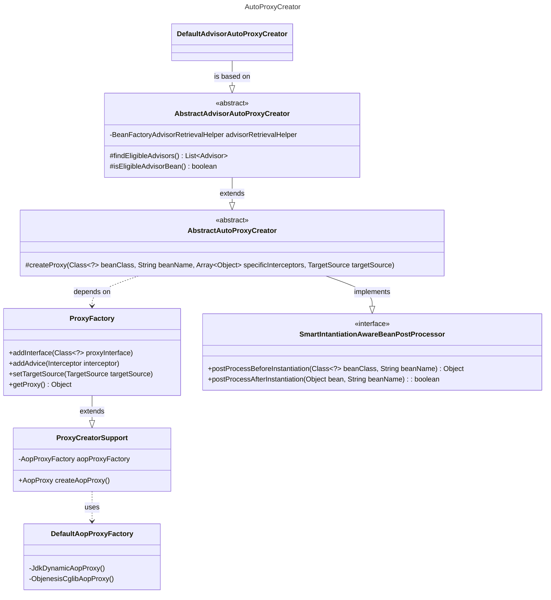

```mermaid
---
title: AutoProxyCreator
---
classDiagram
    direction TB
    class DefaultAdvisorAutoProxyCreator
    class AbstractAdvisorAutoProxyCreator {
        <<abstract>>
        -BeanFactoryAdvisorRetrievalHelper advisorRetrievalHelper
        #findEligibleAdvisors() List~Advisor~
        #isEligibleAdvisorBean() boolean
    }
    class AbstractAutoProxyCreator {
        <<abstract>>
        #createProxy(Class~?~ beanClass, String beanName, Array~Object~ specificInterceptors, TargetSource targetSource)
    }
    class ProxyFactory {
        +addInterface(Class~?~ proxyInterface)
        +addAdvice(Interceptor interceptor)
        +setTargetSource(TargetSource targetSource)
        +getProxy() Object
    }
    class ProxyCreatorSupport {
        -AopProxyFactory aopProxyFactory
        +AopProxy createAopProxy()
    }
    class DefaultAopProxyFactory {
        -JdkDynamicAopProxy()
        -ObjenesisCglibAopProxy()
    }
    class SmartIntantiationAwareBeanPostProcessor {
        <<interface>>
        +postProcessBeforeInstantiation(Class~?~ beanClass, String beanName) Object
        +postProcessAfterInstantiation(Object bean, String beanName): boolean
    }

    DefaultAdvisorAutoProxyCreator --|> AbstractAdvisorAutoProxyCreator : is based on
    AbstractAdvisorAutoProxyCreator --|> AbstractAutoProxyCreator : extends
    AbstractAutoProxyCreator --|> SmartIntantiationAwareBeanPostProcessor : implements
    AbstractAutoProxyCreator ..> ProxyFactory : depends on
    ProxyFactory --|> ProxyCreatorSupport : extends
    ProxyCreatorSupport ..> DefaultAopProxyFactory : uses
```