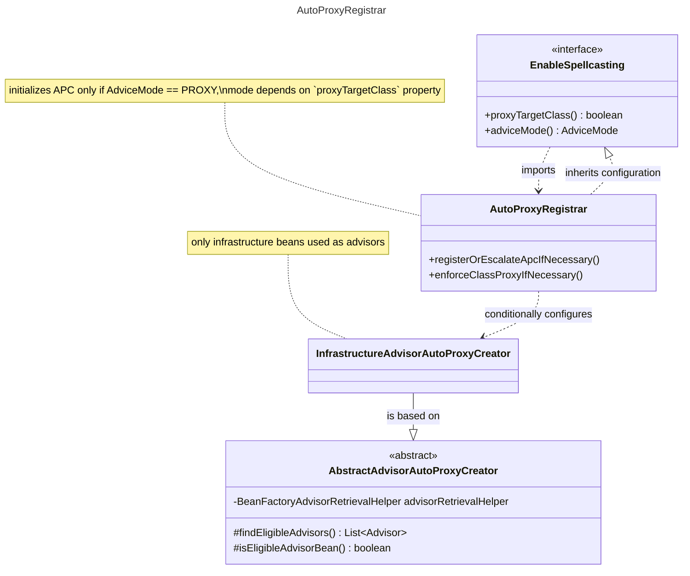

```mermaid
---
title: AutoProxyRegistrar
---
classDiagram
    direction TB
    class EnableSpellcasting {
        <<interface>>
        +proxyTargetClass() boolean
        +adviceMode() AdviceMode
    }
    class AutoProxyRegistrar {
        +registerOrEscalateApcIfNecessary()
        +enforceClassProxyIfNecessary()
    }
    note for AutoProxyRegistrar "initializes APC only if AdviceMode == PROXY,\nmode depends on `proxyTargetClass` property"
    class InfrastructureAdvisorAutoProxyCreator
    note for InfrastructureAdvisorAutoProxyCreator "only infrastructure beans used as advisors"
    class AbstractAdvisorAutoProxyCreator {
        <<abstract>>
        -BeanFactoryAdvisorRetrievalHelper advisorRetrievalHelper
        #findEligibleAdvisors() List~Advisor~
        #isEligibleAdvisorBean() boolean
    }
    
    EnableSpellcasting ..> AutoProxyRegistrar : imports
    AutoProxyRegistrar ..|> EnableSpellcasting : inherits configuration
    AutoProxyRegistrar ..> InfrastructureAdvisorAutoProxyCreator : conditionally configures
    InfrastructureAdvisorAutoProxyCreator --|> AbstractAdvisorAutoProxyCreator : is based on
```