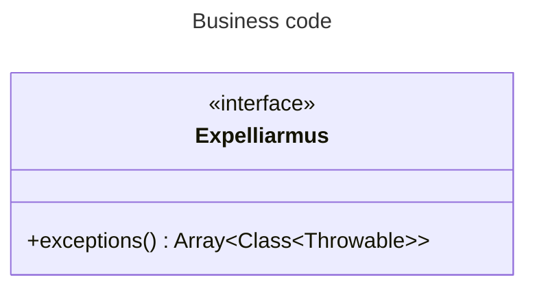
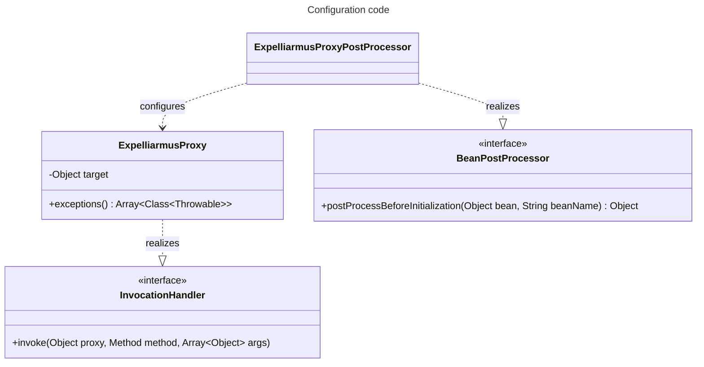

```mermaid
---
title: Business code
---
classDiagram
    class Expelliarmus {
        <<interface>>
        +exceptions() Array~Class~Throwable~~
    }
```

```mermaid
---
title: Configuration code
---
classDiagram
    class ExpelliarmusProxy {
        -Object target
        +exceptions() Array~Class~Throwable~~
    }
    class InvocationHandler {
        <<interface>>
        +invoke(Object proxy, Method method, Array~Object~ args)
    }
    ExpelliarmusProxy ..|> InvocationHandler : realizes
    
    class ExpelliarmusProxyPostProcessor {
        
    }
    class BeanPostProcessor {
        <<interface>>
        +postProcessBeforeInitialization(Object bean, String beanName) Object
    }
    ExpelliarmusProxyPostProcessor ..|> BeanPostProcessor : realizes
    ExpelliarmusProxyPostProcessor ..> ExpelliarmusProxy : configures
```